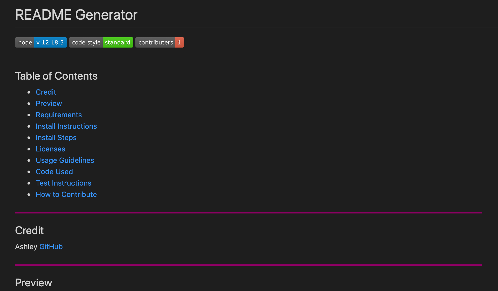

<!-- A file that has all answers for reference to questions that are being asked and to work as a template for desired design and layout-->

# README Generator
    
<a href="https://www.npmjs.org/package/check-node-version"></a><a href="https://standardjs.com"></a><a href="https://github.com/ashhunt07"></a>


<br>

## Table of Contents
    

* [Credit](#credit)
* [Preview](#preview)
* [Requirements](#requirements)
* [Install Instructions](#install-instructions)
* [Install Steps](#install-steps)
* [Licenses](#licenses)
* [Usage Guidelines](#usage-guidelines)
* [Code Used](#code-used)
* [Test Instructions](#test-instructions)
* [How to Contribute](#how-to-contribute)


 

## Credit

Ashley
* [GitHub](https://github.com/ashhunt07)
* [Contact](https://ashhunt07.github.io/portfolio/contact.html)


<br>

 

## Preview


<br>

 

## Requirements

* requirement
* requirement


<br>

 

## Install Instructions

Simply clone repo into your own personal github repo, install all dependencies using the terminal and start running the program with the command: <br>
```
    node index.js
```


<br>

 

## Install Steps

Step 1: Run npm init to create package.json.<br>Follow prompts to fill in information, you can choose defaults for most of this section. <br> 
```
    npm init
```


Step 2: Run npm install for inquirer using the following command: <br> 
```
    npm install inquirer
```


Step 3: Run npm install for util using the following command: <br> 
```
    node install util
```


<br>


 

## Licenses

* The license choice here


<br>

 

## Usage Guidelines

This app can be used to create a custom, and personalized ReadMe.md file for all applications that you are creating!


<br>

 

## Code Used

<br><br>

<br>
<br>


 

## Test Instructions

No current test instructions


<br>

 

## How to Contribute

If you would like to send suggestions or get in contact with me, you can visit my [GitHub](https://github.com/ashhunt07) page and find my contact information in my [portfolio](https://ashhunt07.github.io/portfolio/contact.html). 